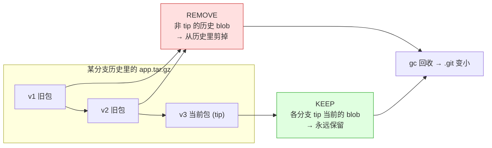
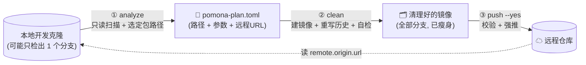
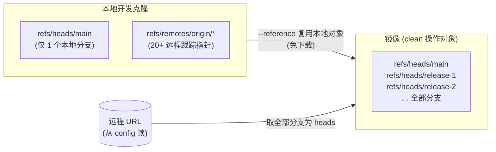

# Pomona

[](https://github.com/omeyang/Pomona/actions/workflows/ci.yml)
[](https://github.com/omeyang/Pomona/actions/workflows/release.yml)
[](https://github.com/omeyang/Pomona/releases/latest)

名字来自古罗马果园女神 **Pomona**：奥维德《变形记》第十四卷写她「不持标枪，右手持弯曲的修枝刀，用来压制过度生长、剪去四处蔓延的枝条」（*nec iaculo gravis est, sed adunca dextera falce, qua modo luxuriem premit et spatiantia passim bracchia compescit*）。借用这一典故，为 git 仓库剪去历史里枯死的旧包，留下每根枝头当前结的果。[典故来源：Ovidius, *Metamorphoses* XIV 623–697（拉丁原文）](https://www.thelatinlibrary.com/ovid/ovid.met14.shtml)

按分支 tip 保留压缩包、清除历史旧版本的 git 瘦身工具。用于**离线部署类项目仓库**：这类仓库有很多个要长期保留的发布分支，每个分支带一个几百 MB 的压缩包，历史里堆积了大量被淘汰的旧版本包，`.git` 越来越大。Pomona 让**每个分支只保留它 tip 当前的那个包，删掉该路径在历史里被淘汰的所有旧版本**，跨全部分支一次完成；提交历史拓扑、分支、各分支当前的包都原样保留。

Rust 编写，静态 musl 单二进制 `git-pomona`，放进 PATH 即是 `git pomona` 子命令。运行时只需要系统里有 `git`，不需要 Python，也不需要 git-filter-repo。

> ⚠️ 这是**工具仓库**，本身不参与你的项目；它清理的是**另一个**仓库。

---

## 为什么必须重写历史

git 按内容存 blob：同一个 `app.tar.gz`，每个版本是一个独立的几百 MB blob。只要引用它的老提交还在，`gc` 就不会回收它，所以**手动「删文件 + commit + gc」不会让 `.git` 变小**（反而因为又加了一版而更大）。唯一能真正回收的办法是**重写历史**让旧 blob 不可达。Pomona 精确删除「非任何分支 tip」的包 blob，tip 版本一个都不动。



---

## 安装

**一键安装**（Linux x86_64 / arm64；root 装到 `/usr/local/bin`，普通用户装到 `~/.local/bin`，自动核对 SHA256）：

```sh
curl -fsSL https://raw.githubusercontent.com/omeyang/Pomona/main/install.sh | sh
```

固定版本或自定义目录：`POMONA_VERSION=v0.1.0 POMONA_INSTALL_DIR=/opt/bin curl ... | sh`。

**手动安装**：从 [Releases](https://github.com/omeyang/Pomona/releases/latest) 下载 `git-pomona-linux-x86_64` 或 `git-pomona-linux-aarch64`，核对 `SHA256SUMS`，改名为 `git-pomona` 放入 PATH。

**源码构建**：`cargo install --git https://github.com/omeyang/Pomona`（Rust 1.85+）。

---

## 三段式流程

职责分离，每一步的产物是下一步的输入，可以分别检查、分别重跑。



| 子命令 | 干什么 | 输入 → 输出 |
|---|---|---|
| `git pomona analyze` | 扫描、选定要清理的包路径，**不动任何仓库** | 本地仓库目录 → plan 文件 |
| `git pomona clean` | 建镜像、重写历史（留 tip 删历史）、自检 | plan 文件 → 清理好的镜像目录 |
| `git pomona push` | 校验、把新历史强推回远程 | 镜像目录 → 推送 + 重新同步指引 |

---

## 快速上手

前提：目标仓库已 `git clone` 到本地（普通克隆即可，本地只检出一个分支也没关系）。建议先在该克隆里 `git fetch --all --prune` 取最新远程状态。

```bash
# ① 分析（只读）。--auto-detect 自动选中所有「超阈值或命中包扩展名」的路径；去掉它则逐个交互确认
git pomona analyze /path/to/本地克隆 --auto-detect -o pomona-plan.toml

# 看一眼 pomona-plan.toml 和预计可回收体积，确认无误后：

# ② 清理（在临时镜像上重写，不动你的克隆，也不动远程）
git pomona clean pomona-plan.toml --workdir /tmp/cleaned-mirror.git

# ③ 先 dry-run 看将执行什么 + 收尾指引
git pomona push /tmp/cleaned-mirror.git

# 确认后真正强推回远程
git pomona push /tmp/cleaned-mirror.git --yes
```

---

## 各子命令选项

### `git pomona analyze <本地仓库目录> [选项]`

| 选项 | 说明 |
|---|---|
| `--remote <名>` | 读哪个 remote 的 URL（默认 `origin`） |
| `-n, --top <N>` | 交互模式逐个审阅的前 N 大（未传时运行时询问，默认 30） |
| `--sort-by <max\|cum>` | 「前 N 大」的排序口径：`max`=单版本最大（默认）、`cum`=累计体积 |
| `--all` | 交互模式审阅全部命中项（不截断到前 N） |
| `--orphans` | 额外选中「所有分支 tip 都不再引用」的孤儿路径（无视大小，自动标记） |
| `--min-size <大小>` | 按大小识别包的阈值，`50M`/`100K`/`2G`/字节（默认取 profile，内置 `50M`） |
| `--auto-detect` | 非交互：选中所有「单版本 ≥ 阈值 或 命中包扩展名」的路径 |
| `--auto-select <正则>` | 非交互：额外选中匹配正则的路径（可重复） |
| `--keep-refs <glob>` | 额外纳入「保留 tip」的 ref（可重复；默认所有分支；例 `refs/tags/*`） |
| `--profile <文件>` | 识别规则配置（默认 `$XDG_CONFIG_HOME/pomona/profile.toml`） |
| `-o, --out <文件>` | plan 输出路径（默认 `./pomona-plan.toml`） |

### `git pomona clean <plan 文件> [选项]`

| 选项 | 说明 |
|---|---|
| `--workdir <目录>` | 镜像克隆的目标目录（默认临时目录） |
| `--engine <native\|filter-repo>` | 重写引擎（默认 `native`；`filter-repo` 需 `pip3.12 install git-filter-repo`） |
| `--assume-yes` | 跳过重写前的确认 |

### `git pomona push <镜像目录> [选项]`

| 选项 | 说明 |
|---|---|
| `--url <URL>` | 远程地址（默认从 `<镜像>.pomona-push.toml` 读） |
| `--yes` | 真正执行强推（默认只 dry-run） |
| `--mirror` | 用 `git push --mirror`（会删除远程上本地没有的 ref）；默认只推 heads + tags |
| `--hooks-dir <目录>` | hooks 所在目录（默认 `$XDG_CONFIG_HOME/pomona/hooks`） |

---

## 镜像是怎么拿到全部分支的

你本地的普通克隆通常**只检出一个分支**，其余 20+ 个分支只是 `origin/*` 远程跟踪指针。直接对它重写没法干净地覆盖所有分支。`clean` 用一条命令解决：从 plan 里的远程 URL 取全部分支（成为真正的 `refs/heads/*`），同时用 `--reference` 复用本地已有对象（几乎不下载），`--dissociate` 让镜像独立。



> 命令：`git clone --mirror --reference <本地> --dissociate <URL> <镜像目录>`

## 包是怎么识别的

**大小阈值 + 扩展名清单，两者取并集：**

- **大小**：任一版本超过 `--min-size` 的路径即视为包。不看扩展名，几百 MB 的包必中，连无扩展名/奇怪格式也能抓到。
- **扩展名**：内置只含归档、包、磁盘镜像格式（`tar/gz/bz2/xz/zst/7z/rar/zip/jar/iso/qcow2/rpm/deb/whl/apk/...`），不含图片、PDF、数据库、共享库。

不同分支的包**可以不同名/不同格式**：KEEP 是所有分支 tip 当前内容的并集，各分支各留各的。

### profile：把公司特有的规律放在配置里

识别规则可以用 TOML 覆盖，加载顺序：内置默认 → `$XDG_CONFIG_HOME/pomona/profile.toml`（存在则叠加）→ `--profile` 指定文件 → 命令行 `--min-size`。只写需要覆盖的字段：

```toml
min_size = "100M"
archive_suffixes = [".tar.gz", ".tgz", ".zip", ".bundle"]
source_suffixes = [".go", ".py", ".sql", "Makefile"]
```

## hooks：推送前后的自定义动作

`push --yes` 时，若 `--hooks-dir`（默认 `$XDG_CONFIG_HOME/pomona/hooks`）下存在可执行文件 `pre-push` / `post-push`，会分别在强推前后执行。`pre-push` 退出码非 0 则中止推送。通过环境变量传参：`POMONA_MIRROR`、`POMONA_URL`、`POMONA_REMOVED_BLOBS`、`POMONA_RECLAIMED_BYTES`、`POMONA_BRANCHES`。典型用途：调 GitLab housekeeping 接口、发通知。

---

## 原生重写引擎

默认引擎不依赖 git-filter-repo，直接用 git 自带的导出 / 导入完成：

1. `git fast-export --all --no-data` 导出全部历史的元数据流（不含 blob 内容）。
2. 逐行过滤：引用了待删 blob 的 `M <mode> <sha> <path>` 改成 `D <path>`，其余原样透传；`data` 块按字节拷贝。
3. `git fast-import --force` 在同一镜像里原地导入；`M` 行引用的 blob 已在对象库中，无需传数据。
4. `reflog expire` + `gc --prune=now` 回收。

结果：各分支 tip 的树对象不变，不涉及待删 blob 的提交 SHA 不变，合并提交与附注标签保留。与 `git filter-repo --strip-blobs-with-ids --prune-empty never` 语义一致，`--engine filter-repo` 可切换回后者做交叉验证。

---

## 安全性

- **绝不删除任何分支 tip 当前在用的 blob**。即使某历史版本与某 tip 字节相同（同一 blob），也因在 KEEP 集里而保留。
- 只动**临时镜像副本**，你的本地克隆和远程在 `push --yes` 之前都不受影响。
- **提交历史拓扑完整保留**：只更新包的中间提交不会被删空。
- **两道自检**：`clean` 结束时与 `push` 开始时都校验「每个分支 tip 的树 SHA 与重写前一致」且「待删 blob 均不可达」，任一不满足即中止。
- 默认**不自动推送**，`push` 默认 dry-run。

---

## 清理之后要做什么（重要）

`push --yes` 强推后，**所有已有克隆都与新历史不一致**，必须重新同步：

- **你本地的旧克隆**（包括 analyze 用的那个）：最简单是删掉重新 `git clone`；或逐分支
  `git fetch origin && git reset --hard origin/<分支> && git reflog expire --all --expire=now && git gc --prune=now`。
- **协作者**：一律重新 clone（他们的旧分支基于被改写的历史，不能直接 pull）。
- **远程服务器磁盘**：强推只是让旧对象不可达；自建 GitLab / Gitea 需服务端 `git gc` / housekeeping（可能要管理员操作）才会真正回收磁盘。

---

## 离线场景

若开发机连不上远程（纯离线），plan 里没有 `url`、只有 `local` 时，`clean` 会镜像本地克隆并把 `refs/remotes/origin/*` 重映射为 `refs/heads/*`，完全用本地对象重建全部分支。这种情况下分析的是本地已 fetch 的状态，务必确保本地是最新的；`push` 时需显式 `--url`。

---

## 测试

```bash
cargo test
```

单元测试覆盖大小解析、KEEP/REMOVE 计算、选路规则、fast-export 流过滤、plan / profile 读写；集成测试用真实 `git` 搭建多分支多版本仓库，端到端跑 analyze → clean → push（含真正强推与新克隆校验）、同内容 blob 安全性、无扩展名按大小识别、纯离线镜像、hooks；两种重写引擎各跑一遍（未装 git-filter-repo 时回退引擎的用例跳过）。

## 已知限制

- 路径按 UTF-8 lossy 处理，含非法 UTF-8 字节的路径可能识别不准。
- 提交签名与签名标签的签名会被剥离（`fast-export` 与 git-filter-repo 皆如此）。
- 不处理 `refs/replace/*`。

## License

MIT
